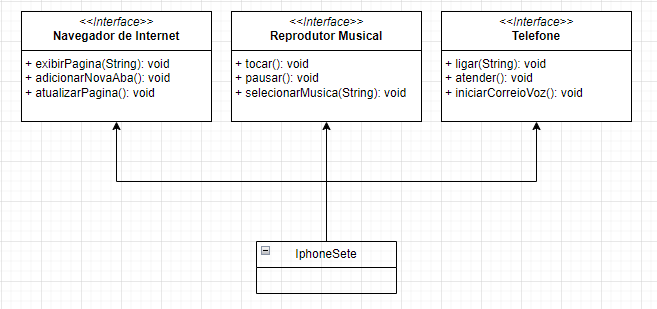

# Desafio implementação de Interfaces - DIO

Conforme desafio foi solicitado a diagramação UML de acordo com case do lançamento do Iphone 7, que possui a capacidade de Navegar pela Internet, Reproduzir Músicas e Telefonar.

Abaixo segue o Diagrama UML e no repositório a implementação em JAVA.

### Conteúdos praticados

 

 
